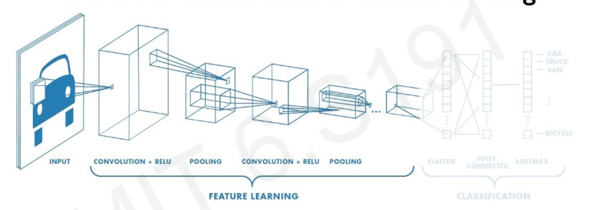

# _Deep Learning_: **CNNs**

> more on this topic [here](https://www.youtube.com/watch?v=oGpzWAlP5p0&t=962s)



## Pytorch version

```python
import torch.nn as nn

class CNN:
    def __init__():
        self.model = nn.Sequential([
            # first convolutional layer
            nn.Conv2D(in_channels=3, out_channels=32, filter_size=3),
            # ^TODO: to learn the filters' weights
            nn.ReLU(),
            nn.MaxPool2D(kernel_size=2, strides=2),


            # second convolutional layer
            nn.Conv2D(in_channels=3, out_channels=32, filter_size=3),
            # ^TODO: to learn the filters' weights
            nn.ReLU(),
            nn.MaxPool2D(kernel_size=2, strides=2),

            # fully connected classifier
            nn.Flatten(),
            nn.Linear(64*6*6, 1024), # flattened dim after 2 conv layers
            nn.ReLU(),
            nn.Linear(1024, 10), # 10 outputs
        ])
```

## Tensorflow version

```python
import tensorflow as tf

class CNN:
    def __init__():
        self.model = tf.keras.Sequential([
            # first convolutional layer
            tf.keras.Conv2D(32, filter_size=3, activation='relu'),
            # ^TODO: to learn the filters' weights
            tf.keras.MaxPool2D(pool_size=2, strides=2),

            # second convolutional layer
            tf.keras.Conv2D(32, filter_size=3, activation='relu'),
            # ^TODO: to learn the filters' weights
            tf.keras.MaxPool2D(pool_size=2, strides=2),

            # fully connected classifier
            tf.keras.Flatten(),
            tf.keras.Dense(1024, activation='relu'),
            tf.keras.Dense(10, activation='softmax'), # 10 outputs
        ])
```
