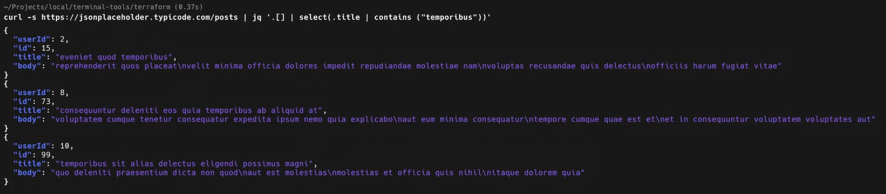

# Learn `jq`

## Installation

### Linux
jq is in the official Debian and Ubuntu repositories. Install using 
```
sudo apt-get install jq
```
The binaries should just run, but on macOS and Linux you may need to make them executable first using chmod +x jq.

### macOS
```bash
brew install jq
```


### Windows
```
winget install jqlang.jq
```

## Usage
```
$JSON_INPUT | jq
```

## Example
