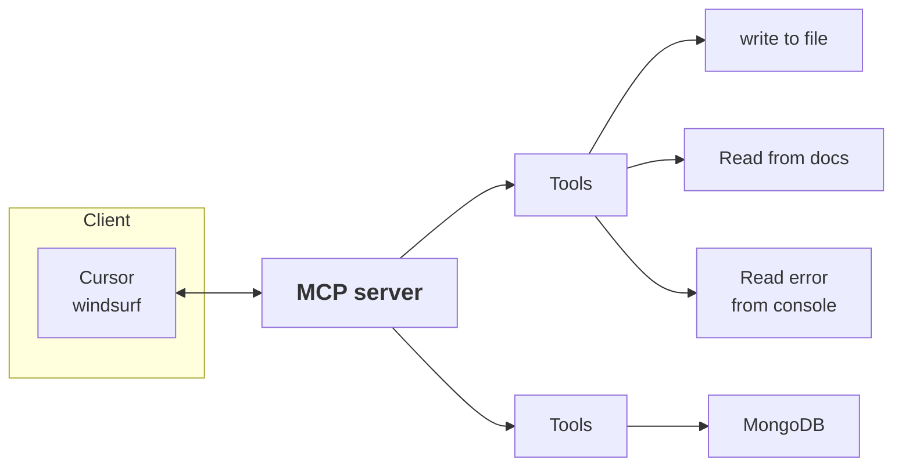
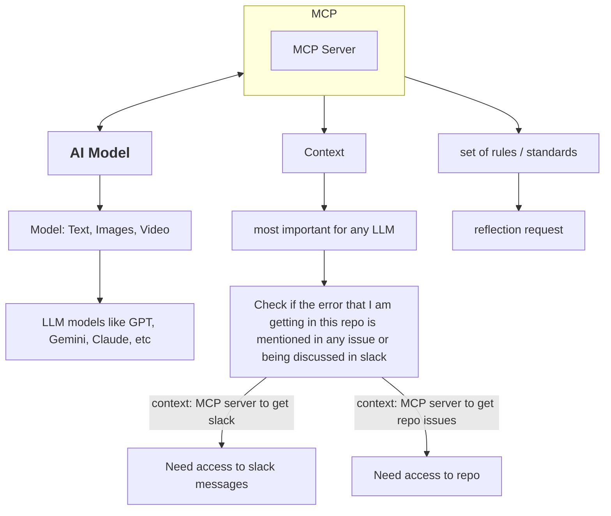

# _MCP Server_: What is it all about?

> Official Write-up [here](https://www.anthropic.com/news/model-context-protocol)!
>
> [docs here](https://modelcontextprotocol.io/introduction)

It all starts with LLMs...

They are fancy next word predictors that are very advacned and have seen large amounts of data, either in form of text or otherwise.

Basically, bro can help you write an essay on a specific topic, answer a query based on what it knows already.

But, bro fails to email this essay to Sam Altman, or run a SQL query on a database, things that are out of its reach to do.

SO, there are many things that an LLM can't do. But, it has enough knowleadge about most of these things. So, we can wrap the LLM around our service to make it do a specific task.
Some examples include:
1. Search the internet (perplexity, etc.)
1. Edit code files (copilot, cursor)
1. Create figma designs
1. create premier pro editing 

These are called tools nowadays.

There was no standard/protocol that was set to make all these things happen.

MCP is that standard that can be used now.

## Model Context Protocol

