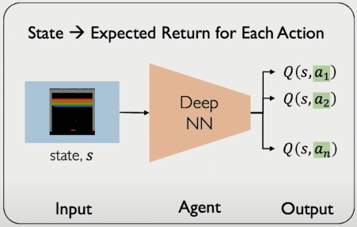
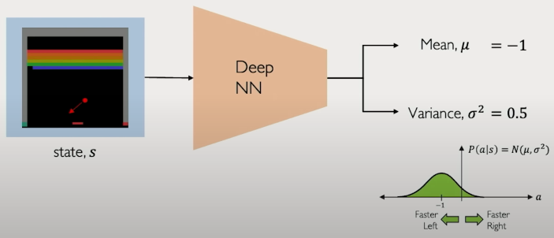

# _Reinforcement Learning_: The 3rd class of Learning Problems

All we have is state and action pairs!

**Goal**: To maximize future rewards over many time steps

## Key concepts

| Entity      | Description                                                  |
| ----------- | ------------------------------------------------------------ |
| Agent       | This is the thing that takes actions(A), A$\in$ Action Space |
| Environment | This is where the actions take place.                        |

## Deep RL algorithms:

- $\pi$ is known as the policy function
- $Q$ is known as the Q function, which is the expected total future reward an agent in state $s$ can receive by doing an action $a$.
  $$
  R_t\ =\ r_t + \gamma r_{t+1} + \gamma^2 r_{t+2} + \dots\\[3pt]
  Q(s, a)\ =\ \mathbb{E}[R_t|s_t, a_t]
  $$

| Value Learning          | Policy Learning         |
| ----------------------- | ----------------------- |
| Find $Q(s, a)$          | Find $\pi(s)$           |
| $a = \argmax_a Q(s, a)$ | Sample $a \sim \pi(s) $ |

## Deep Q Networks

How can we use Deep Neural Networks to model Q-functions?

 

### What if we tak all the best actions?

- Maximize target return $\rightarrow$ train the agent
- Conidering that we want to train a Neural Network, we would need a target and a prediction value.

  $$
    target = r_t + \gamma \max_{a'}Q(s', a') \\[3pt]
    predicted = Q(s, a)
  $$

  $\therefore$ The loss function could be just the mean squared loss.

  $$

  \mathcal{L} = \mathbb{E} \left[ \left\| \left( r + \gamma \max_{a'} Q(s', a') \right) - Q(s, a) \right\|^2 \right]
  $$

  This is also known as the Q-Loss.

- Use the NN to learn the Q-function and then use to infer the optimal policy, $\pi(s)$.
  $$
  \pi(s) = \argmax_a Q(s, a)
  $$
- Send the action back to the environment and receive the next state.

### Any Downsides?

- Complexity:
  - Can model scenarios where action space is _small and discrete_.
  - Cannot handle continuous action space.

- Flexibility:
  - Policy is _deterministically_ computed based on the Q-function by maximizing the reward $\rightarrow$ cannot learn stochastic policies.

> To address these shortcomings, there is a new class o RL training algorithms: _Policy Gradient Methods_.

## Policy Gradient

#### Directly optimize the policy $\pi(s)$


- We can sample from this probability distribution.
- Ofcourse we need the output to have their sum be equal to 1.

- What are the advantages of this formulation?
  - Now, we can deal with both discrete and continuous action space.
  - For example, like this. 

### Training Algorithm

```python
def train():
    model = DNN() # could be a simple pytorch sequential nn

    for i in range(epochs):
        agent = init_agent()
        history = []
        while agent is not terminated(): # not ideal for using it in real world
            action, reward = model.predict(agent.state)
            his = [agent.state, action, reward]
            environment.apply(action)

            history.append(his)

        # loss = -log(P(a_t|s_t)) * R_t
        # weight update: w = w - ∇loss
        #                w = w + ∇log(P(a_t|s_t))R_t

        decrease prob..lity of actions that resulted in low reward      # this is just backpropagation
        increase prob..lity of actions that resulted in high reward     # this is just backpropagation
    return model
```
